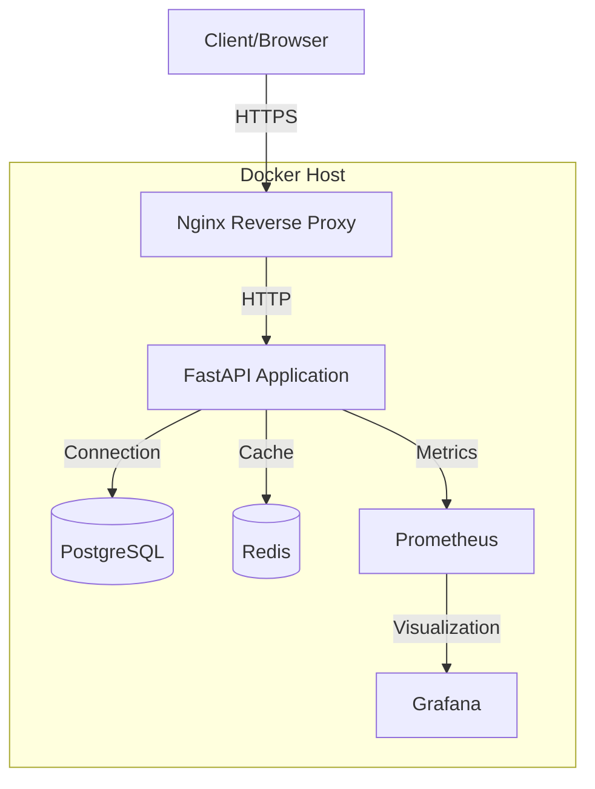

# Branch Loans API - System Architecture

## High-Level Architecture



## Component Details

### 1. Nginx Reverse Proxy
- **Purpose**: SSL termination, load balancing, and request routing
- **Ports**:
  - 80 (HTTP) - Redirects to HTTPS
  - 443 (HTTPS) - Main entry point
- **Features**:
  - SSL/TLS termination
  - Rate limiting
  - Static file serving
  - Gzip compression

### 2. FastAPI Application
- **Port**: 8000
- **Features**:
  - RESTful API endpoints
  - Database connection pooling
  - Request validation
  - Authentication & Authorization
  - Rate limiting
  - Request/Response logging

### 3. PostgreSQL Database
- **Port**: 5432
- **Features**:
  - Persistent data storage
  - Connection pooling
  - Automated backups
  - Read replicas (in production)

### 4. Redis Cache
- **Port**: 6379
- **Features**:
  - Session storage
  - Rate limiting
  - Caching layer
  - Pub/Sub for real-time features

### 5. Monitoring Stack
- **Prometheus**:
  - Metrics collection
  - Alerting
  - Time-series database
- **Grafana**:
  - Dashboards
  - Visualization
  - Alerting UI

## Data Flow

1. **Request Flow**:
   ```
   Client → Nginx (SSL Termination) → FastAPI → Database/Cache → Response
   ```

2. **Metrics Flow**:
   ```
   FastAPI (Metrics) → Prometheus (Scrapes) → Grafana (Visualization)
   ```

3. **Logs Flow**:
   ```
   All Services → Docker Logs → Centralized Logging (e.g., ELK Stack)
   ```

## Security Considerations

1. **Network Security**:
   - All external traffic uses HTTPS
   - Internal service communication uses private Docker network
   - Firewall rules restrict access to management ports

2. **Data Security**:
   - Encryption at rest for sensitive data
   - Regular backups
   - Database connection encryption

3. **Authentication**:
   - JWT-based authentication
   - Rate limiting
   - CORS policies

## Scaling Strategy

1. **Horizontal Scaling**:
   - API instances can be scaled based on load
   - Database read replicas for read-heavy workloads
   - Redis cluster for distributed caching

2. **Load Balancing**:
   - Nginx as a load balancer
   - Round-robin distribution
   - Health checks for backend services

## Environment Variables

Key environment variables used across services:

```env
# Application
ENVIRONMENT=development|staging|production
LOG_LEVEL=INFO
SECRET_KEY=your-secret-key

# Database
POSTGRES_USER=user
POSTGRES_PASSWORD=password
POSTGRES_DB=dbname
DATABASE_URL=postgresql://user:password@db:5432/dbname

# Redis
REDIS_HOST=redis
REDIS_PORT=6379
REDIS_PASSWORD=redis-password

# Nginx
NGINX_HTTP_PORT=8080
NGINX_HTTPS_PORT=8443
```

## Deployment Topology

```
                          ┌─────────────────┐
                          │  Load Balancer  │
                          │   (Optional)    │
                          └────────┬────────┘
                                   │
                   ┌───────────────┴────────────────┐
          ┌────────┴────────┐            ┌─────────┴─────────┐
    ┌─────▼─────┐    ┌──────▼──────┐ ┌───▼────┐    ┌─────────▼─────────┐
    │  Web-1    │    │   Web-2     │ │  Web-3 │    │      Web-N        │
    │  Nginx    │    │   Nginx     │ │ Nginx  │    │      Nginx        │
    │  FastAPI  │    │   FastAPI   │ │ FastAPI│    │      FastAPI      │
    └─────┬─────┘    └──────┬──────┘ └───┬────┘    └─────────┬─────────┘
          │                 │            │                   │
          └─────────────────┼────────────┼───────────────────┘
                            │            │
                    ┌───────▼───────┐    │
                    │  PostgreSQL  │    │
                    │  Primary     │    │
                    └───────┬───────┘    │
                            │            │
                    ┌───────▼───────┐    │
                    │  PostgreSQL  │     │
                    │  Replica     │     │
                    └──────────────┘     │
                                        │
                                ┌───────▼───────┐
                                │    Redis     │
                                │   Cluster    │
                                └──────────────┘
```

## Monitoring and Alerting

### Key Metrics
- **API**: Request rate, error rate, latency
- **Database**: Connection count, query performance, replication lag
- **System**: CPU, memory, disk I/O, network
- **Business**: Active users, loan applications, success rate

### Alerting Rules
1. **Critical**: Service down, 5xx errors > 1%
2. **Warning**: High latency (>1s p95), high error rate (>0.1%)
3. **Info**: Deployment events, configuration changes

## Backup Strategy

1. **Database**:
   - Continuous WAL archiving
   - Daily full backups
   - Point-in-time recovery

2. **Application Data**:
   - Regular backups of uploads
   - Versioned backups
   - Off-site storage

3. **Configuration**:
   - Version controlled
   - Encrypted secrets
   - Regular backups

## Disaster Recovery

1. **Recovery Point Objective (RPO)**: 5 minutes
2. **Recovery Time Objective (RTO)**: 15 minutes
3. **Failover Procedure**:
   - Promote read replica
   - Update DNS/load balancer
   - Notify team

## Maintenance Windows

- **Database Maintenance**: Weekly, Sunday 2:00-4:00 AM UTC
- **System Updates**: Monthly, first Saturday of the month
- **Backup Verification**: Daily, automated checks

## Dependencies

- **Infrastructure**:
  - Docker Engine 20.10+
  - Docker Compose 2.0+
  - 2+ vCPUs, 4GB RAM (minimum)
  - 20GB+ disk space

- **Services**:
  - PostgreSQL 14+
  - Redis 6+
  - Nginx 1.21+

## Network Ports

| Port  | Service    | Protocol | Description                     |
|-------|------------|----------|---------------------------------|
| 80    | Nginx      | TCP      | HTTP (redirects to HTTPS)       |
| 443   | Nginx      | TCP      | HTTPS                           |
| 8000  | FastAPI    | TCP      | API Service                     |
| 5432  | PostgreSQL | TCP      | Database                        |
| 6379  | Redis      | TCP      | Caching                         |
| 9090  | Prometheus | TCP      | Metrics                         |
| 3000  | Grafana    | TCP      | Monitoring Dashboard            |
| 9100  | Node Exporter | TCP   | System Metrics                  |
