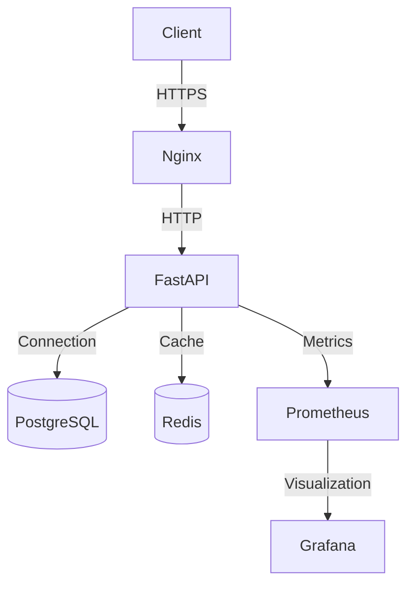

# Branch Loans API

A production-ready REST API for microloans, built with FastAPI, SQLAlchemy, PostgreSQL, and Docker. This project is containerized and includes CI/CD pipelines for automated testing, building, and deployment.

### 1. Clone the repository

```bash
git clone https://github.com/yourusername/branch-loans-api.git
cd branch-loans-api
```

### 2. Set up environment

#### Windows

```powershell
# Run PowerShell as Administrator
Set-ExecutionPolicy Bypass -Scope Process -Force
.\scripts\setup.ps1
```

#### Linux/macOS

```bash
# Make the setup script executable
chmod +x ./scripts/setup.sh

# Run the setup script
./scripts/setup.sh
```

This will:
- Generate SSL certificates
- Configure local hosts file
- Set up required environment variables

### 3. Start the application

```bash
# Start in development mode
docker compose -f docker-compose.yml -f docker-compose.dev.yml up --build
```

Access the API at:
- API: https://branchloans.com:8080
- API Docs: https://branchloans.com:8080/docs
- Health Check: https://branchloans.com:8080/health

## 🏗 Project Structure

```
.
├── .github/                # GitHub workflows and templates
│   └── workflows/          # CI/CD pipelines
├── app/                    # Application code
│   ├── api/                # API endpoints
│   ├── core/               # Core functionality
│   ├── db/                 # Database models and migrations
│   ├── schemas/            # Pydantic models
│   └── services/           # Business logic
├── nginx/                  # Nginx configuration
│   ├── conf.d/             # Nginx server configurations
│   └── ssl/                # SSL certificates
├── scripts/                # Utility scripts
├── tests/                  # Test suite
├── .env.example            # Example environment variables
├── docker-compose.yml      # Base Docker Compose config
├── docker-compose.dev.yml  # Development overrides
├── docker-compose.prod.yml # Production overrides
└── pyproject.toml          # Python project configuration
```

### Running the Application

#### Development Mode

```bash
# Start all services
docker compose -f docker-compose.yml -f docker-compose.dev.yml up --build

# Run in detached mode
docker compose -f docker-compose.yml -f docker-compose.dev.yml up -d

# View logs
docker compose logs -f

# Stop all services
docker compose down
```

#### Production Mode

```bash
# Build and start in production mode
docker compose -f docker-compose.yml -f docker-compose.prod.yml up --build -d

# View logs
docker compose logs -f

# Stop all services
docker compose down -v
```
## 🚀 Deployment

### Environments

| Environment | File | Description |
|-------------|------|-------------|
| Development | `docker-compose.dev.yml` | Local development with hot-reload |
| Staging | `docker-compose.staging.yml` | Staging environment (similar to production) |
| Production | `docker-compose.prod.yml` | Production deployment with optimizations |


### Architecture

For a detailed architecture overview, see [ARCHITECTURE.md](ARCHITECTURE.md).

The system consists of the following components:

- **Nginx**: Reverse proxy with SSL termination
- **FastAPI**: Python API service
- **PostgreSQL**: Primary database
- **Redis**: Caching and rate limiting
- **Prometheus**: Metrics collection
- **Grafana**: Monitoring dashboards




## 📚 API Documentation

Once the application is running, access the interactive API documentation:

- Swagger UI: https://localhost:8443/docs
- ReDoc: https://localhost:8443/redoc


### Health Checks

```bash
# Basic health check
curl -k https://localhost:8443/health

# Detailed health check
curl -k https://localhost:8443/health/detailed
```


## 🐛 Troubleshooting

### Common Issues

#### 1. Port Conflicts

If you get port conflicts, update the ports in `.env`:

```env
API_PORT=8000
NGINX_HTTP_PORT=8080
NGINX_HTTPS_PORT=8443
POSTGRES_PORT=5432
```


### 1. Clone the repository

```bash
git clone https://github.com/yourusername/branch-loans-api.git
cd branch-loans-api
```

### 2. Set up SSL certificates and hosts file (Windows)

Run the setup script as administrator:

```powershell
# In PowerShell (Run as Administrator)
Set-ExecutionPolicy Bypass -Scope Process -Force
.\setup_ssl_and_hosts.ps1
```

For Linux/macOS, you'll need to manually:
1. Generate SSL certificates using the script in `nginx/ssl/generate_ssl.sh`
2. Add the following to your `/etc/hosts` file:
   ```
   127.0.0.1    branchloans.com www.branchloans.com
   ```

### 3. Start the application

```bash
docker-compose up --build -d
```

### 4. Access the application

- API: https://branchloans.com
- Health Check: https://branchloans.com/health
- API Documentation: https://branchloans.com/docs

> **Note**: You might see a security warning because of the self-signed certificate. You can safely proceed by accepting the certificate in your browser.

## Project Structure

```
.
├── app/                    # Application source code
│   ├── __init__.py         # Application factory
│   ├── main.py             # Main application module
│   ├── config.py           # Configuration settings
│   ├── db.py               # Database configuration
│   ├── models/             # Database models
│   ├── routes/             # API routes
│   └── schemas.py          # Pydantic schemas
├── nginx/                  # Nginx configuration
│   ├── nginx.conf          # Nginx configuration
│   └── ssl/                # SSL certificates
├── tests/                  # Test files
├── .env.example           # Example environment variables
├── docker-compose.yml     # Docker Compose configuration
├── Dockerfile             # Application Dockerfile
└── requirements.txt       # Python dependencies
```

## Available Endpoints

- `GET /health` - Health check endpoint
- `GET /api/loans` - List all loans
- `GET /api/loans/{id}` - Get specific loan details
- `POST /api/loans` - Create new loan application
- `GET /api/stats` - Get loan statistics

## Environment Variables

| Variable | Description | Default |
|----------|-------------|---------|
| `DATABASE_URL` | PostgreSQL connection URL | `postgresql+psycopg2://postgres:postgres@db:5432/microloans` |
| `PORT` | Application port | `8000` |
| `CORS_ORIGINS` | Allowed CORS origins | `["https://branchloans.com"]` |

## Development

### Running the development server

```bash
docker-compose up --build
```

### Running tests

```bash
docker-compose run --rm api pytest
```

### Accessing the database

```bash
# Connect to the database container
docker-compose exec db psql -U postgres -d microloans
```

## Production Deployment

1. Set up environment variables in `.env` file
2. Update SSL certificates with valid ones from Let's Encrypt
3. Run in production mode:
   ```bash
   docker-compose -f docker-compose.yml -f docker-compose.prod.yml up -d
   ```
### 1. Configure Local Domain
Add the following line to your hosts file (`C:\Windows\System32\drivers\etc\hosts`):
```
127.0.0.1   branchloans.com www.branchloans.com
```

### 2. Generate SSL Certificates
Run the following command to generate self-signed SSL certificates:
```bash
# On Windows (PowerShell as Administrator):
.\generate_ssl.ps1

# On Linux/macOS:
chmod +x nginx/ssl/generate_ssl.sh
./nginx/ssl/generate_ssl.sh
```

### 3. Build and Start Services
```bash
docker compose up -d --build
```

### 4. Run Database Migrations
```bash
docker compose exec api alembic upgrade head
```

### 5. Seed Dummy Data (Optional)
```bash
docker compose exec api python scripts/seed.py
```

### 6. Access the API
- API: https://branchloans.com
- Health Check: https://branchloans.com/health
- API Docs: https://branchloans.com/api/docs

## API Endpoints

| Method | Endpoint | Description |
|--------|----------|-------------|
| GET    | /health | Health check |
| GET    | /api/loans | List all loans |
| GET    | /api/loans/:id | Get loan details |
| POST   | /api/loans | Create new loan |
| GET    | /api/stats | Get loan statistics |


