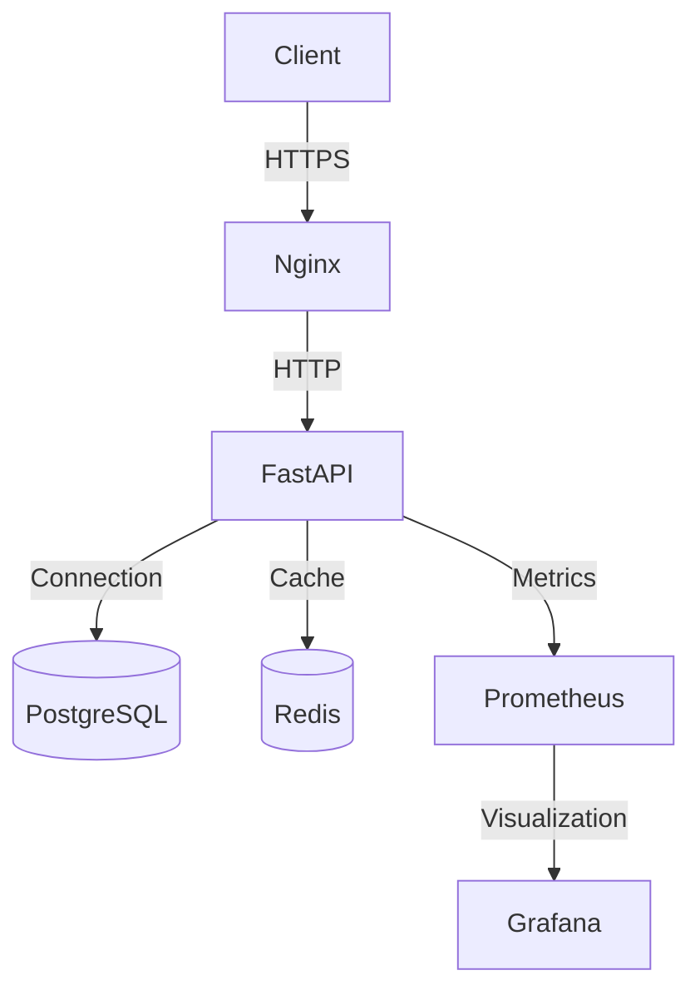

# Branch Loans API

A production-ready REST API for microloans, built with FastAPI, SQLAlchemy, PostgreSQL, and Docker. This project is containerized and includes CI/CD pipelines for automated testing, building, and deployment.

## 📋 Table of Contents
- [Features](#-features)
- [Tech Stack](#-tech-stack)
- [Prerequisites](#-prerequisites)
- [Quick Start](#-quick-start)
- [Project Structure](#-project-structure)
- [Development](#-development)
  - [Environment Setup](#environment-setup)
  - [Running Tests](#running-tests)
  - [Code Style](#code-style)
- [Deployment](#-deployment)
  - [Environments](#environments)
  - [CI/CD Pipeline](#cicd-pipeline)
  - [Architecture](#architecture)
- [API Documentation](#-api-documentation)
- [Monitoring](#-monitoring)
- [Troubleshooting](#-troubleshooting)
- [License](#-license)

## 🚀 Features

- 🐳 **Containerized** with Docker for consistent environments
- 🔒 **HTTPS** with self-signed certificates for secure local development
- 🌐 **Nginx** reverse proxy with SSL termination
- 🏗️ **Multi-environment** support (development, staging, production)
- ⚡ **FastAPI** for high-performance API endpoints
- 🗄️ **PostgreSQL** with persistent storage
- 🧪 **Automated testing** with pytest
- 🔄 **CI/CD** pipeline with GitHub Actions
- 🔍 **Code quality** checks with flake8 and black
- 🔒 **Security scanning** with Trivy
- 📊 **Code coverage** reporting with Codecov

## 🛠 Tech Stack

- **Backend**: Python 3.11, FastAPI, SQLAlchemy, Pydantic
- **Database**: PostgreSQL 16
- **Web Server**: Nginx
- **Containerization**: Docker, Docker Compose
- **CI/CD**: GitHub Actions
- **Testing**: pytest, pytest-cov
- **Code Quality**: black, isort, flake8
- **Security**: Trivy, Dependabot
- **Monitoring**: Prometheus, Grafana (optional)

## 📋 Prerequisites

- [Docker](https://www.docker.com/get-started) 20.10+
- [Docker Compose](https://docs.docker.com/compose/install/) v2.0+
- [Git](https://git-scm.com/)
- [Python](https://www.python.org/downloads/) 3.11+ (for local development)
- [OpenSSL](https://www.openssl.org/) (included with Git for Windows)
- [Make](https://www.gnu.org/software/make/) (optional, for convenience commands)

## 🚀 Quick Start

### 1. Clone the repository

```bash
git clone https://github.com/yourusername/branch-loans-api.git
cd branch-loans-api
```

### 2. Set up environment

#### Windows

```powershell
# Run PowerShell as Administrator
Set-ExecutionPolicy Bypass -Scope Process -Force
.\scripts\setup.ps1
```

#### Linux/macOS

```bash
# Make the setup script executable
chmod +x ./scripts/setup.sh

# Run the setup script
./scripts/setup.sh
```

This will:
- Generate SSL certificates
- Configure local hosts file
- Set up required environment variables

### 3. Start the application

```bash
# Start in development mode
docker compose -f docker-compose.yml -f docker-compose.dev.yml up --build
```

Access the API at:
- API: https://branchloans.com:8080
- API Docs: https://branchloans.com:8080/docs
- Health Check: https://branchloans.com:8080/health

## 🏗 Project Structure

```
.
├── .github/                # GitHub workflows and templates
│   └── workflows/          # CI/CD pipelines
├── app/                    # Application code
│   ├── api/                # API endpoints
│   ├── core/               # Core functionality
│   ├── db/                 # Database models and migrations
│   ├── schemas/            # Pydantic models
│   └── services/           # Business logic
├── nginx/                  # Nginx configuration
│   ├── conf.d/             # Nginx server configurations
│   └── ssl/                # SSL certificates
├── scripts/                # Utility scripts
├── tests/                  # Test suite
├── .env.example            # Example environment variables
├── docker-compose.yml      # Base Docker Compose config
├── docker-compose.dev.yml  # Development overrides
├── docker-compose.prod.yml # Production overrides
└── pyproject.toml          # Python project configuration
```

## 💻 Development

### Environment Setup

1. Copy the example environment file:

```bash
cp .env.example .env
```

2. Update the environment variables in `.env` as needed.

### Running the Application

#### Development Mode

```bash
# Start all services
docker compose -f docker-compose.yml -f docker-compose.dev.yml up --build

# Run in detached mode
docker compose -f docker-compose.yml -f docker-compose.dev.yml up -d

# View logs
docker compose logs -f

# Stop all services
docker compose down
```

#### Production Mode

```bash
# Build and start in production mode
docker compose -f docker-compose.yml -f docker-compose.prod.yml up --build -d

# View logs
docker compose logs -f

# Stop all services
docker compose down -v
```

### Running Tests

```bash
# Run all tests
docker compose -f docker-compose.test.yml up --build --abort-on-container-exit

# Run specific test file
docker compose -f docker-compose.test.yml run --rm api pytest tests/test_endpoints.py -v

# Run with coverage report
docker compose -f docker-compose.test.yml run --rm api pytest --cov=app --cov-report=term-missing
```

### Code Style

This project uses:
- **black** for code formatting
- **isort** for import sorting
- **flake8** for linting

```bash
# Format code with black and isort
docker compose run --rm api black .
docker compose run --rm api isort .

# Check code style
docker compose run --rm api flake8 .
```

## 🚀 Deployment

### Environments

| Environment | File | Description |
|-------------|------|-------------|
| Development | `docker-compose.dev.yml` | Local development with hot-reload |
| Staging | `docker-compose.staging.yml` | Staging environment (similar to production) |
| Production | `docker-compose.prod.yml` | Production deployment with optimizations |

### CI/CD Pipeline

The GitHub Actions workflow includes:

1. **Test**
   - Run unit and integration tests
   - Check code coverage
   - Upload coverage to Codecov

2. **Build**
   - Build Docker images
   - Cache dependencies for faster builds
   - Scan for vulnerabilities with Trivy

3. **Deploy** (on main branch or tags)
   - Push to GitHub Container Registry
   - Deploy to staging on push to `main`
   - Deploy to production on new tags (v*)

### Architecture

For a detailed architecture overview, see [ARCHITECTURE.md](ARCHITECTURE.md).

The system consists of the following components:

- **Nginx**: Reverse proxy with SSL termination
- **FastAPI**: Python API service
- **PostgreSQL**: Primary database
- **Redis**: Caching and rate limiting
- **Prometheus**: Metrics collection
- **Grafana**: Monitoring dashboards



### Manual Deployment

1. Build and push the Docker image:

```bash
docker build -t ghcr.io/yourusername/branch-loans-api:latest .
docker push ghcr.io/yourusername/branch-loans-api:latest
```

2. Deploy to your infrastructure:

```bash
# Example: Deploy to Kubernetes
kubectl apply -f k8s/
```

## 📚 API Documentation

Once the application is running, access the interactive API documentation:

- Swagger UI: https://branchloans.com:8080/docs
- ReDoc: https://branchloans.com:8080/redoc

## 📊 Monitoring

### Health Checks

```bash
# Basic health check
curl -k https://localhost:8080/health

# Detailed health check
curl -k https://localhost:8080/health/detailed
```

### Metrics (Prometheus)

```
http://localhost:8080/metrics
```

### Logs

```bash
# View logs
docker compose logs -f

# View API logs
docker compose logs -f api

# View Nginx logs
docker compose logs -f nginx
```

## 🐛 Troubleshooting

### Common Issues

#### 1. Port Conflicts

If you get port conflicts, update the ports in `.env`:

```env
API_PORT=8000
NGINX_HTTP_PORT=8080
NGINX_HTTPS_PORT=8443
POSTGRES_PORT=5432
```

#### 2. SSL Certificate Errors

If you get SSL errors, regenerate the certificates:

```bash
rm -rf nginx/ssl/*
./scripts/generate_ssl.sh
```

#### 3. Database Connection Issues

Check if the database is running:

```bash
docker compose ps
docker compose logs db
```

### Viewing Logs

```bash
# View all logs
docker compose logs -f

# View API logs
docker compose logs -f api

# View Nginx logs
docker compose logs -f nginx

# View database logs
docker compose logs -f db
```

## 📄 License

This project is licensed under the MIT License - see the [LICENSE](LICENSE) file for details.

## 🙏 Acknowledgments

- [FastAPI](https://fastapi.tiangolo.com/)
- [Docker](https://www.docker.com/)
- [PostgreSQL](https://www.postgresql.org/)
- [Nginx](https://www.nginx.com/)

### 1. Clone the repository

```bash
git clone https://github.com/yourusername/branch-loans-api.git
cd branch-loans-api
```

### 2. Set up SSL certificates and hosts file (Windows)

Run the setup script as administrator:

```powershell
# In PowerShell (Run as Administrator)
Set-ExecutionPolicy Bypass -Scope Process -Force
.\setup_ssl_and_hosts.ps1
```

For Linux/macOS, you'll need to manually:
1. Generate SSL certificates using the script in `nginx/ssl/generate_ssl.sh`
2. Add the following to your `/etc/hosts` file:
   ```
   127.0.0.1    branchloans.com www.branchloans.com
   ```

### 3. Start the application

```bash
docker-compose up --build -d
```

### 4. Access the application

- API: https://branchloans.com
- Health Check: https://branchloans.com/health
- API Documentation: https://branchloans.com/docs

> **Note**: You might see a security warning because of the self-signed certificate. You can safely proceed by accepting the certificate in your browser.

## Project Structure

```
.
├── app/                    # Application source code
│   ├── __init__.py         # Application factory
│   ├── main.py             # Main application module
│   ├── config.py           # Configuration settings
│   ├── db.py               # Database configuration
│   ├── models/             # Database models
│   ├── routes/             # API routes
│   └── schemas.py          # Pydantic schemas
├── nginx/                  # Nginx configuration
│   ├── nginx.conf          # Nginx configuration
│   └── ssl/                # SSL certificates
├── tests/                  # Test files
├── .env.example           # Example environment variables
├── docker-compose.yml     # Docker Compose configuration
├── Dockerfile             # Application Dockerfile
└── requirements.txt       # Python dependencies
```

## Available Endpoints

- `GET /health` - Health check endpoint
- `GET /api/loans` - List all loans
- `GET /api/loans/{id}` - Get specific loan details
- `POST /api/loans` - Create new loan application
- `GET /api/stats` - Get loan statistics

## Environment Variables

| Variable | Description | Default |
|----------|-------------|---------|
| `DATABASE_URL` | PostgreSQL connection URL | `postgresql+psycopg2://postgres:postgres@db:5432/microloans` |
| `PORT` | Application port | `8000` |
| `CORS_ORIGINS` | Allowed CORS origins | `["https://branchloans.com"]` |

## Development

### Running the development server

```bash
docker-compose up --build
```

### Running tests

```bash
docker-compose run --rm api pytest
```

### Accessing the database

```bash
# Connect to the database container
docker-compose exec db psql -U postgres -d microloans
```

## Production Deployment

1. Set up environment variables in `.env` file
2. Update SSL certificates with valid ones from Let's Encrypt
3. Run in production mode:
   ```bash
   docker-compose -f docker-compose.yml -f docker-compose.prod.yml up -d
   ```

## Troubleshooting

### Certificate Errors

If you see certificate errors in your browser:
1. Make sure you've run the setup script as administrator
2. Manually install the certificate by double-clicking `nginx/ssl/branchloans.crt`
3. Select "Local Machine" and place the certificate in the "Trusted Root Certification Authorities" store

### Port Conflicts

If you get port conflicts (especially on Windows):
- Stop any applications using ports 80, 443, or 5432
- Or update the ports in `docker-compose.yml`

## License

MIT

### 1. Configure Local Domain
Add the following line to your hosts file (`C:\Windows\System32\drivers\etc\hosts`):
```
127.0.0.1   branchloans.com www.branchloans.com
```

### 2. Generate SSL Certificates
Run the following command to generate self-signed SSL certificates:
```bash
# On Windows (PowerShell as Administrator):
.\generate_ssl.ps1

# On Linux/macOS:
chmod +x nginx/ssl/generate_ssl.sh
./nginx/ssl/generate_ssl.sh
```

### 3. Build and Start Services
```bash
docker compose up -d --build
```

### 4. Run Database Migrations
```bash
docker compose exec api alembic upgrade head
```

### 5. Seed Dummy Data (Optional)
```bash
docker compose exec api python scripts/seed.py
```

### 6. Access the API
- API: https://branchloans.com
- Health Check: https://branchloans.com/health
- API Docs: https://branchloans.com/api/docs

## API Endpoints

| Method | Endpoint | Description |
|--------|----------|-------------|
| GET    | /health | Health check |
| GET    | /api/loans | List all loans |
| GET    | /api/loans/:id | Get loan details |
| POST   | /api/loans | Create new loan |
| GET    | /api/stats | Get loan statistics |

## Development

### Environment Variables
Create a `.env` file with the following variables:
```
# Database
POSTGRES_USER=postgres
POSTGRES_PASSWORD=postgres
POSTGRES_DB=microloans
DATABASE_URL=postgresql+psycopg2://${POSTGRES_USER}:${POSTGRES_PASSWORD}@db:5432/${POSTGRES_DB}

# Application
FLASK_ENV=development
PORT=8000
PYTHONPATH=/app

# Nginx
NGINX_HOST=branchloans.com
NGINX_PORT=443
```

### Running Tests
```bash
docker compose exec api pytest
```

## Deployment

The application is configured with GitHub Actions for CI/CD. The workflow includes:
1. Running tests
2. Building Docker images
3. Scanning for vulnerabilities
4. Pushing to container registry
5. Deploying to production (manual trigger)

## Architecture

```
┌─────────────┐     ┌─────────────┐     ┌─────────────┐
│   Client    │ ──> │    Nginx    │ ──> │    API      │
└─────────────┘     │  (SSL/TLS)  │     │  (Flask)    │
                    └─────────────┘     └──────┬──────┘
                                            │
                                            ▼
                                    ┌─────────────┐
                                    │  PostgreSQL │
                                    └─────────────┘
```

## Security

- All traffic is encrypted with TLS 1.2/1.3
- Secure headers are configured in Nginx
- Database credentials are stored in environment variables
- Container security best practices are followed

## Troubleshooting

### Certificate Warnings
If you see certificate warnings in your browser:
1. Open `https://branchloans.com`
2. Click "Advanced" > "Proceed to branchloans.com (unsafe)"
3. Install the certificate in your trusted root store

### Port Conflicts
If you encounter port conflicts (80/443), check for other services using these ports:
```bash
# On Windows
netstat -ano | findstr :80
netstat -ano | findstr :443
```

## License

This project is licensed under the MIT License - see the [LICENSE](LICENSE) file for details.